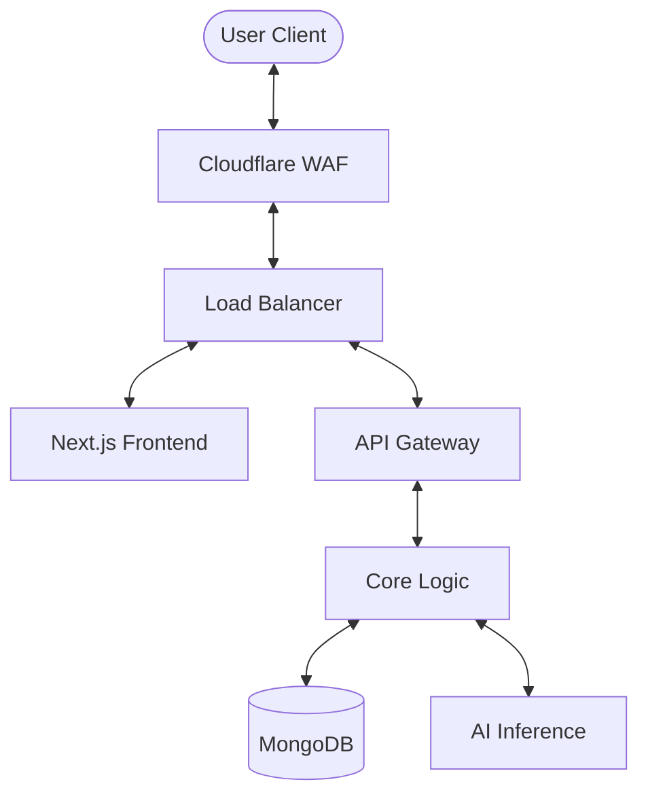

# AI-Powered EdTech Platform – Complete System & Strategic Blueprint

## SECTION 1: Vision & Philosophy

### Core Mission: IndividyaBot

The mission of **IndividyaBot** is to revolutionize education by transitioning from a "streaming platform" (passive consumption) to a "holistic AGI-driven ecosystem." It aims to prepare children for their lifelong goals from childhood, integrating traditional wisdom (Gurukul System) with cutting-edge AGI, robotics, and brain-interface technologies. The goal is to create "Brilliant Minded Students" who are experts in their chosen fields by age 18, balancing high-tech proficiency with mental wellness and ethical grounding.

### Problem in Current Education Systems

Current systems rely on "one-size-fits-all" curriculum delivery, where students are forced to follow a rigid pace regardless of their individual grasping power. The focus is often on rote memorization ("Ratta Maar") rather than conceptual mastery or real-world application.

### Why Streaming Platforms Fail

Traditional EdTech platforms (like Coursera or Udemy) function primarily as video repositories. They lack:

- **Active Dialogue**: No real-time interaction or doubt resolution.
- **Adaptive Remediation**: If a student fails a concept, the video doesn't change; it just sits there.
- **Holistic Development**: No focus on routines, diet, meditation, or soft skills.
- **Emotional Intelligence**: inability to detect when a student is frustrated or bored.

### Personalization Gap

Most platforms claim "personalization" based only on course recommendations. IndividyaBot defines personalization at the **synaptic level**, adapting the very language, examples (e.g., using "Khan Sir" style humor or local regional analogies), and format (3D vs Text) to the student's current neural state and cultural context.

### Ethical & Digital Wellness Vision

IndividyaBot is built to be a "Guardian AI." It doesn't just teach; it monitors screen time, encourages physical breaks, and integrates motivational quotes. It aims to foster a healthy relationship between humans and machines, ensuring technology serves the student's well-being rather than causing burnout.

### Preventing AI Over-Dependency

A critical component of our philosophy is the **"Guided Problem Solving"** mechanism. The AI is programmed to intentionally provide hints and Socratic questions rather than direct answers, forcing the student to use their own critical thinking. It acts as a scaffold that eventually removes itself as the student gains mastery.

---

## SECTION 2: Complete Feature Architecture (Part 1: Features 1-10)

### 1. Personalized Learning Paths

- **Problem it solves**: Overwhelmed students not knowing where to start or following irrelevant curriculums.
- **Functional behavior**: Generates a dynamic tree-based roadmap from "Zero to Hero" for any skill.
- **User flow**: `Student inputs goal (e.g., Medical AI)` -> `AI assesses current knowledge` -> `Generates sequence of nodes` -> `Adapts path based on test performance`.
- **AI models used**: Transformer-based sequence models (GPT-4/Llama-3) for path planning.
- **Algorithms involved**: Pathfinding (A* style) on a massive knowledge graph of 1M+ educational concepts.
- **Data required**: Historical success patterns of 1M+ students, skill hierarchy database.
- **Backend logic**: Graph database (Neo4j) queries to find optimal paths based on prerequisites.
- **Database schema logic**: `Nodes {id, name, difficulty}, Edges {from, to, dependency_type}`.
- **Scalability concerns**: Real-time path recalculation for millions of users necessitates efficient caching.
- **Failure cases**: Recursive loops in knowledge graphs; solved via cycle-detection algorithms.
- **Ethical safeguards**: Path diversification to prevent "filter bubbles" in education.
- **Future upgrade potential**: Integration with labor market APIs for real-time path adjustments.

### 2. Adaptive Learning Models

- **Problem it solves**: Fixed difficulty levels causing boredom (too easy) or anxiety (too hard).
- **Functional behavior**: Dynamically modifies lesson content, quiz difficulty, and explanation depth in real-time.
- **User flow**: `Student finishes module` -> `Performance analysis` -> `Next module complexity is adjusted (+/- 15%)`.
- **AI models used**: Reinforcement Learning (Proximal Policy Optimization - PPO).
- **Algorithms involved**: Bayesian Knowledge Tracing (BKT), Item Response Theory (IRT).
- **Data required**: Real-time clickstream data, response times, precision-recall on sub-topics.
- **Backend logic**: Logic engine calculates "Z-Score" of performance and updates the user's "Mastery Vector."
- **Database schema logic**: `MasteryState {user_id, topic_id, confidence_score, last_attempt}`.
- **Scalability concerns**: High-frequency database writes; use Redis for transient state.
- **Failure cases**: AI penalizing a student for a typo; solved by NLP-based "Intent Analysis" before scoring.
- **Ethical safeguards**: Transparency—students are told *why* a level was adjusted.
- **Future upgrade potential**: Emotional state integration via camera feed (with consent).

### 3. Predictive Exam Analysis

- **Problem it solves**: Inefficient revision and exam anxiety.
- **Functional behavior**: Predicts potential exam questions and areas of weakness based on historical trends and current performance.
- **User flow**: `Aggregate 10 years of paper data` + `User's practice results` -> `Generate "High Probability Question List"`.
- **AI models used**: Time-series forecasting (LSTMs/Transformers).
- **Algorithms involved**: Pattern Recognition, Frequency Analysis of educational material.
- **Data required**: Past 10-20 years of competitive exam data (GATE, UPSC, IIT-JEE), User assessment history.
- **Backend logic**: Aggregator scripts fetch latest syllabus updates and calculate "Topic Importance Score."
- **Database schema logic**: `ExamTrends {exam_id, year, topic_weightage_map}`.
- **Scalability concerns**: Large-scale data mining requirement during peak exam seasons.
- **Failure cases**: Over-reliance causing neglect of "low probability" but critical topics; solved by "Coverage Guards."
- **Ethical safeguards**: Strictly marked as "Probability" not "Leakage"—maintaining academic integrity.
- **Future upgrade potential**: Personalized mock exams that mimic the official exam's difficulty shift.

### 4. Career Path Forecasting

- **Problem it solves**: Students pursuing degrees that are becoming obsolete.
- **Functional behavior**: Long-term prediction of which skills will be in demand by the time the student graduates (3-5 years out).
- **User flow**: `User selects interest` -> `AI projects industry growth` -> `Simulates potential earnings and job availability`.
- **AI models used**: Econometric Forecasting Models combined with LLM trend analysis.
- **Algorithms involved**: Monte Carlo simulations for career trajectory variability.
- **Data required**: Global job market feeds (LinkedIn/Indeed), Economic reports, Patent filings.
- **Backend logic**: Integration with external APIs to fetch real-time salary and demand data.
- **Database schema logic**: `CareerMarket {job_title, growth_rate, skill_nodes[]}`.
- **Scalability concerns**: Keeping internal market data synced with fast-changing global trends.
- **Failure cases**: Black swan events (e.g., sudden AI breakthroughs); solved by weekly model retraining.
- **Ethical safeguards**: Anti-bias filters to ensure career advice isn't gender or socio-economically stereotyped.
- **Future upgrade potential**: VR career simulations ("A day in the life").

### 5. Skill Demand Analysis

- **Problem it solves**: Mismatch between university curricula and industry needs.
- **Functional behavior**: Real-time extraction of skills required in the tech industry today.
- **User flow**: `Dashboard view` -> `Highest Trending Skills (e.g., MLOps, AGI Systems)` -> `Click to add to Learning Path`.
- **AI models used**: BERT-based Named Entity Recognition (NER) for skill extraction from job postings.
- **Algorithms involved**: TF-IDF and Attention mechanisms for keyword importance.
- **Data required**: Daily scrape of 50,000+ job descriptions.
- **Backend logic**: Microservice periodically scans data sources and updates a "Skill Heatmap."
- **Database schema logic**: `SkillHeatmap {skill_id, demand_score, vacancy_count}`.
- **Scalability concerns**: Web scraping rate limits; solved via distributed proxy rotation.
- **Failure cases**: Inflation of "buzzwords"; solved by cross-referencing with project requirement docs.
- **Ethical safeguards**: Highlighting "Eco-friendly" and "Ethical" skills as high priority.
- **Future upgrade potential**: Direct integration with company HR portals for "Verified Skill Badges."

### 6. AGI-Powered Virtual Tutor

- **Problem it solves**: 1:1 human tutoring is too expensive and not 24/7.
- **Functional behavior**: A conversational partner that imitates human-level intelligence, uses humor, and explains concepts via 3D/Video.
- **User flow**: `Student asks "Explain Quantum Physics using a sandwich analogy"` -> `AI generates voice + 3D visual` -> `Student interacts with the visual`.
- **AI models used**: Advanced MM-LLM (Multi-Modal Large Language Models like Gemini 1.5 Pro / Llama-3).
- **Algorithms involved**: Contextual Attention, Semantic Search (on local knowledge base).
- **Data required**: Deep domain knowledge (NCERT, Gurukul texts, Robotics manuals), User's past conversational tone.
- **Backend logic**: Orchestration layer handles the sync between Text-to-Speech (TTS) and 3D Avatar animation.
- **Database schema logic**: `ConversationHistory {user_id, logs[{role, text, visual_metadata}]}`.
- **Scalability concerns**: GPU inference cost; solved by Triage system (using local models for easy questions).
- **Failure cases**: Hallucinations; solved by "Fact-Check" layer against verified textbooks.
- **Ethical safeguards**: "Safe-to-Children" filters, prevents political/religious radicalization.
- **Future upgrade potential**: Holographic Projection (AR/VR).

### 7. Real-Time Communication System

- **Problem it solves**: Isolation in online learning; inability to collaborate.
- **Functional behavior**: WebSocket-based chat, video calls, and collaborative whiteboards for students/teachers.
- **User flow**: `User enters "Study Room"` -> `Connects to peers` -> `AI moderates conversation to keep it educational`.
- **AI models used**: Real-time moderation AI (Sentiment & Toxicity detection).
- **Algorithms involved**: WebSocket broadcasting, P2P WebRTC for video.
- **Data required**: Real-time message streams.
- **Backend logic**: Node.js/Socket.io handling high-concurrency event loops.
- **Database schema logic**: `Rooms {id, members[], chat_logs_ref}`.
- **Scalability concerns**: Maintaining low latency for 1M+ concurrent socket connections.
- **Failure cases**: Network jitters; solved by graceful degradation to text.
- **Ethical safeguards**: Anti-bullying filters (automatic flagging of harassment).
- **Future upgrade potential**: Multi-language translation in real-time during voice calls.

### 8. Sentiment Analysis Monitoring

- **Problem it solves**: Silent struggling; inability of 1:Many systems to detect student frustration.
- **Functional behavior**: Monitors text and voice input to detect if a student is confused, frustrated, or bored.
- **User flow**: `Student types "I don't get this"` (Frustrated tone) -> `AI detects sentiment` -> `Offers a simpler example or suggests a 5-min break`.
- **AI models used**: RoBERTa-based sentiment classifiers, Audio emotion detection.
- **Algorithms involved**: VADER (text), Fourier Transforms (voice pitch analysis).
- **Data required**: User's baseline sentiment profile.
- **Backend logic**: Async processing pipeline—does not block the main interaction.
- **Database schema logic**: `EmotionalLog {user_id, timestamp, sentiment_vector, trigger_module}`.
- **Scalability concerns**: Processing real-time audio streams for sentiment is computationally heavy.
- **Failure cases**: Cultural misinterpretation of tone; solved by user-specific calibration.
- **Ethical safeguards**: Privacy—emotional data is used for learning optimization ONLY, never shared.
- **Future upgrade potential**: Face-tracking for micro-expressions (with webcam access).

### 9. Speech Recognition & Voice Processing

- **Problem it solves**: Keyboard barriers; better for young children and accessibility.
- **Functional behavior**: High-accuracy STT (Speech-to-Text) allowing "Hands-Free" learning.
- **User flow**: `User speaks "Hey Tutor, show me the human heart"` -> `AI processes audio` -> `Triggers 3D anatomical model`.
- **AI models used**: OpenAI Whisper v3 (Large), Google Speech-to-Text.
- **Algorithms involved**: Mel-Frequency Cepstral Coefficients (MFCCs).
- **Data required**: Diverse accent training data (especially Indian accents/Hinglish).
- **Backend logic**: Audio chunking and streaming to inference server.
- **Database schema logic**: `VoiceSamples {user_id, audio_ref, transcript}` (if stored).
- **Scalability concerns**: High bandwidth requirement for audio streaming.
- **Failure cases**: Background noise interference; solved by on-device noise suppression models.
- **Ethical safeguards**: "Mute" hardware-level privacy indicators; children data protection (COPPA).
- **Future upgrade potential**: Personal voice cloning for the tutor (e.g., student's parent or favorite teacher).

### 10. Multi-Format Content Delivery

- **Problem it solves**: Not everyone learns well from just reading text or watching videos.
- **Functional behavior**: Automatically converts any lesson into Video, 3D Interactive, Audio, or Text.
- **User flow**: `Lesson: Gravity` -> `Select '3D Simulation'` -> `Interact with Earth-Moon system`.
- **AI models used**: Text-to-Video models, 3D Reconstruction from Text (Gaussian Splatting/NeRFs).
- **Algorithms involved**: Media transcoding, Automatic captioning, Dynamic layout generation.
- **Data required**: Massive library of 3D assets and video segments.
- **Backend logic**: Content Delivery Network (CDN) optimization for multi-format assets.
- **Database schema logic**: `ContentBundle {id, module_ref, format_map{type: url}}`.
- **Scalability concerns**: Massive storage and egress costs for high-res 3D/Video files.
- **Failure cases**: Incompatible device hardware (low-end phones); solved by "Format Triage."
- **Ethical safeguards**: Ensuring content accessibility for visually/hearing impaired.
- **Future upgrade potential**: Instant AR overlay on physical textbooks.

### 11. Real-Time Content Updating System

- **Problem it solves**: Outdated curriculum (e.g., standard textbooks don't cover yesterday's AI breakthrough).
- **Functional behavior**: Intelligent web-scrapers and link-integrators that inject the latest news/research into relevant courses.
- **User flow**: `New research paper on AGI released` -> `AI extracts key concepts` -> `Automatically adds "Reading Material" node to AGI Mastery path`.
- **AI models used**: GPT-4 based summarization and knowledge extraction.
- **Algorithms involved**: Web Scraping (Scrapy/Playwright), NER for keyword mapping.
- **Data required**: RSS feeds, ArXiv API, trusted news sources (Google News API).
- **Backend logic**: Scheduled cron jobs that trigger the pipeline and notify students of "Fresh Knowledge."
- **Database schema logic**: `Updates {id, module_id, content_snippet, source_url, timestamp}`.
- **Scalability concerns**: Maintaining high relevance without overwhelming students with noise.
- **Failure cases**: "Fake News" injection; solved by multi-source cross-verification.
- **Ethical safeguards**: Fact-checking bypass for controversial topics; human moderator flagging.
- **Future upgrade potential**: Integration with government portals for official syllabus changes.

### 12. Parent Notification & Reporting System

- **Problem it solves**: Parents feel disconnected from their child's digital learning progress.
- **Functional behavior**: Automated, clear, and actionable reports sent via WhatsApp/Email. Includes "Absenteeism" alerts.
- **User flow**: `Child skips class` -> `AI detects inactivity` -> `Calculates performance dip` -> `Sends WhatsApp to Parent`.
- **AI models used**: NLP for "Human-like" summary generation (no technical jargon).
- **Algorithms involved**: Trigger-based event handling.
- **Data required**: Attendance logs, test results, time-spent-on-task metrics.
- **Backend logic**: Twilio/SendGrid integration for multi-channel messaging.
- **Database schema logic**: `ParentReports {id, student_id, stats_blob, last_sent}`.
- **Scalability concerns**: Handling 10M+ notifications daily in real-time.
- **Failure cases**: SMS delivery failure; solved by retry logic and in-app backup.
- **Ethical safeguards**: "Progressive Privacy"—older students can control what their parents see.
- **Future upgrade potential**: Parent-Teacher AI meetings (virtualized).

### 13. Spaced Repetition Engine

- **Problem it solves**: The "Forgetting Curve"—students forget 70% of material after 24 hours.
- **Functional behavior**: Schedules micro-quizzes at the exact moment a student is about to forget a concept.
- **User flow**: `Learns 'Photosynthesis'` -> `AI schedules 1-min review at 24h, 3 days, 1 week, 1 month`.
- **AI models used**: Predictive "Probability of Recall" models (SuperMemo-2 based RL).
- **Algorithms involved**: SM-2, Anki-style scheduling.
- **Data required**: Historical performance on specific nodes.
- **Backend logic**: Queue-based scheduler (BullMQ/Redis) that surfaces review items on dashboard.
- **Database schema logic**: `Flashcards {id, user_id, difficulty_factor, interval, repetitions}`.
- **Scalability concerns**: High-frequency dashboard refreshes per card.
- **Failure cases**: Student burnout (too many reviews); solved by "Adaptive Review Capping."
- **Ethical safeguards**: Balancing retention with mental health.
- **Future upgrade potential**: Visual flashcards using generated 3D models.

### 14. Scenario-Based Simulation Engine

- **Problem it solves**: Theoretical knowledge without practical application.
- **Functional behavior**: Creates "Realistic Experiments" where students make decisions and see consequences.
- **User flow**: `Business course` -> `AI Simulates a Startup` -> `Student makes hiring decisions` -> `AI generates financial outcome`.
- **AI models used**: Game-theory models, LLMs for world-building and character dialogue.
- **Algorithms involved**: Branching Logic, Decision Trees.
- **Data required**: Real-world case studies from industry partners.
- **Backend logic**: State-machine based engine to track simulation progress.
- **Database schema logic**: `SimState {user_id, sim_id, decision_log, current_score}`.
- **Scalability concerns**: Running complex interactive simulations for thousands of students.
- **Failure cases**: Logic loops; solved by simulation "Reset" and "Hint" triggers.
- **Ethical safeguards**: No simulations involving unethical/harmful real-world behavior.
- **Future upgrade potential**: High-fidelity Physics-based simulations for engineering.

### 15. Real-Time Progress Dashboard

- **Problem it solves**: Lack of transparency; student doesn't know where they stand globally.
- **Functional behavior**: Beautifully visualized "Skill Tree" showing mastery percentage and rank.
- **User flow**: `Opens Home` -> `Sees progress bar and "Global Mastery Rank"` -> `Clicks to see sub-skill breakdown`.
- **AI models used**: Clustering algorithms to group students into performance cohorts.
- **Algorithms involved**: Data Aggregation, Percentile Calculation.
- **Data required**: Every recorded interaction (granularity: millisecond).
- **Backend logic**: Aggregation pipeline (Kafka -> ClickHouse) for sub-second updates.
- **Database schema logic**: `AnalyticsHub {user_id, skill_id, mastery_level, rank}`.
- **Scalability concerns**: Database load from real-time charts; solved by Materialized Views.
- **Failure cases**: Data delay; solved by optimistic UI updates.
- **Ethical safeguards**: Preventing "Self-Esteem Drops"—focus on growth, not just competition.
- **Future upgrade potential**: Predictive "Success Probability" for future jobs.

### 16. Multilingual Translation System

- **Problem it solves**: Language barriers; massive knowledge base only in English.
- **Functional behavior**: On-the-fly translation of text, audio, and video into 100+ languages including Hinglish.
- **User flow**: `English Video` -> `Toggle 'Hindi'` -> `AI translates audio + overlays translated text on 3D models`.
- **AI models used**: Neural Machine Translation (NMT) - SeamlessM4T, DeepL.
- **Algorithms involved**: Tokenization, Cross-lingual embeddings.
- **Data required**: Bilingual parallel corpora.
- **Backend logic**: CDN-hosted localized audio streams; dynamic字幕 (caption) generation.
- **Database schema logic**: `Localizations {id, language_code, content_blob}`.
- **Scalability concerns**: Computational cost of real-time multi-modal translation.
- **Failure cases**: Nuance loss; solved by "Context-Aware Translation."
- **Ethical safeguards**: Preserving cultural integrity in translated materials.
- **Future upgrade potential**: Instant translation for peer-to-peer communication.

### 17. Accessibility System (TTS/STT)

- **Problem it solves**: Excluding students with visual or hearing impairments.
- **Functional behavior**: High-quality Text-to-Speech (TTS) for the blind and real-time captions for the deaf.
- **User flow**: `Blind student enters` -> `AI reads out visual 3D scene descriptions` -> `Voice navigation enabled`.
- **AI models used**: ElevenLabs/Google TTS, Whisper STT.
- **Algorithms involved**: Image-to-Text (Captioning) using CLIP/BLIP models.
- **Data required**: Accessibility metadata for all UI components.
- **Backend logic**: Audio backend with low latency for interactive screen-reading.
- **Database schema logic**: `AccessibilityMetadata {element_id, alt_text, audio_description_url}`.
- **Scalability concerns**: TTS generation cost per word.
- **Failure cases**: Mis-captioning technical terms; solved by domain-specific vocabularies.
- **Ethical safeguards**: Zero compromise on accessibility standards (WCAG 2.1).
- **Future upgrade potential**: Sign language generation via 3D Avatars.

### 18. Ethical AI & Bias Detection Engine

- **Problem it solves**: AI reflecting societal biases or providing harmful advice.
- **Functional behavior**: Sub-system that scans all AI outputs for bias, toxicity, or misinformation before display.
- **User flow**: `AI generates answer` -> `Bias Engine scans` -> `If clean, displays; if biased, auto-refines`.
- **AI models used**: Custom LLM Guardrails, Toxicity Classifiers (Perspective API).
- **Algorithms involved**: Adversarial testing, Logit bias manipulation.
- **Data required**: Balanced datasets representing all cultures/genders.
- **Backend logic**: Interceptor middleware in the inference pipeline.
- **Database schema logic**: `AuditLogs {request_id, response_hash, bias_score, flags[]}`.
- **Scalability concerns**: Extra latency added to every request.
- **Failure cases**: Over-censorship; solved by "Contextual Slack."
- **Ethical safeguards**: Transparency report on AI fairness provided to regulators.
- **Future upgrade potential**: Self-correcting AI that learns its own biases.

### 19. Voice-Based Answer Validation System

- **Problem it solves**: MCQs don't test deep understanding.
- **Functional behavior**: Student explains a concept verbally; AI analyzes semantic accuracy and depth.
- **User flow**: `Exam Question: Newton's 3rd Law?` -> `User speaks answer` -> `AI detects if key conceptual nodes are present`.
- **AI models used**: Semantic Similarity (SBERT), Speech-to-Text + LLM Analysis.
- **Algorithms involved**: Cosine Similarity, Concept Mapping.
- **Data required**: Knowledge base of "Golden Answers" for all topics.
- **Backend logic**: Logic checks for "Key Conceptual Nodes" in the transcript.
- **Database schema logic**: `VoiceAnswers {q_id, transcript, score, feedback_text}`.
- **Scalability concerns**: Simultaneous audio processing during peak exam hours.
- **Failure cases**: Accent rejection; solved by "Multi-Accent Robustness Training."
- **Ethical safeguards**: Manual review option if student disagrees with AI grade.
- **Future upgrade potential**: Humor/Tone matching in feedback.

### 20. Gamification System (points, badges, leaderboards)

- **Problem it solves**: Low motivation and drop-out rates in online courses.
- **Functional behavior**: Points for consistency, Badges for milestones, and Localized Leaderboards.
- **User flow**: `Finishes Module` -> `Earns +50 XP` -> `Unlocks "Newton's Apprentice" badge` -> `Sees progress on School Leaderboard`.
- **AI models used**: Dynamic reward scaling (extra XP for "Struggled then Succeeded").
- **Algorithms involved**: Leaderboard sorting (Redis-based), Leveling logic.
- **Data required**: Gaming mechanics metrics.
- **Backend logic**: Real-time event emitters to trigger celebratory UI animations.
- **Database schema logic**: `GamificationProfile {user_id, total_xp, badges[], streak_days}`.
- **Scalability concerns**: Maintaining consistent leaderboards across multiple regions.
- **Failure cases**: Cheating for points; solved by "Anti-Gaming AI" (detecting patterns).
- **Ethical safeguards**: Preventing "Gaming Addiction"—caps on total daily XP.
- **Future upgrade potential**: Physical rewards or scholarships tied to XP.

### 21. Admin Control & Analytics Dashboard

- **Problem it solves**: Managing directors and educators need a high-level view of platform health and student success.
- **Functional behavior**: Centralized hub for content management, user moderation, and visual analytics (Tableau-style).
- **User flow**: `Admin logs in` -> `Views cohort performance` -> `Identifies trending errors` -> `Modifies curriculum node`.
- **AI models used**: Cohort Analysis, Predictive Dropout models.
- **Algorithms involved**: K-Means Clustering, Random Forest (for risk prediction).
- **Data required**: Aggregated platform logs.
- **Backend logic**: RESTful API for CRUD ops on courses; ClickHouse for analytics.
- **Database schema logic**: `AuditLogs {admin_id, action, timestamp}`.
- **Scalability concerns**: Real-time filtering on TBs of log data.
- **Failure cases**: Unauthorized access; solved by Multi-Factor Authentication (MFA).
- **Ethical safeguards**: Role-based access (least privilege principle).
- **Future upgrade potential**: AI-driven "Marketing Suggestions" for student acquisition.

### 22. Continuous Model Retraining Pipeline

- **Problem it solves**: AI models becoming stale as educational standards evolve.
- **Functional behavior**: Automated MLOps pipeline that sucks in new student data and retrains models offline.
- **User flow**: `New data threshold met` -> `Trigger training on AWS SageMaker` -> `Validate accuracy` -> `Blue/Green deployment`.
- **AI models used**: AutoML, Transfer Learning.
- **Algorithms involved**: Gradient Descent, Hyperparameter Tuning.
- **Data required**: Anonymized interaction datasets.
- **Backend logic**: Jenkins/GitHub Actions triggering Dockerized training jobs.
- **Database schema logic**: `ModelRegistry {version, accuracy_at_test, deploy_date}`.
- **Scalability concerns**: High compute cost for retraining Large Language Models.
- **Failure cases**: Catastrophic forgetting; solved by "Stability Guards."
- **Ethical safeguards**: Periodic bias audits on new weights.
- **Future upgrade potential**: Federated learning (privacy-preserving retraining).

### 23. Digital Wellness Monitoring

- **Problem it solves**: Screen addiction, poor posture, and cognitive fatigue.
- **Functional behavior**: AI "Guardian" that suggests breaks, meditation, and physical exercise.
- **User flow**: `2 hours of continuous study` -> `Screen dims slightly` -> `AI suggests: "Take a 5-min walk, look 20 feet away"`.
- **AI models used**: Usage Pattern Recognition.
- **Algorithms involved**: Time-window analysis.
- **Data required**: Session duration and frequency.
- **Backend logic**: Foreground service on mobile that tracks active "Education Time."
- **Database schema logic**: `WellnessLog {user_id, sessions[], alerts_triggered[]}`.
- **Scalability concerns**: Low-latency push notification delivery.
- **Failure cases**: Intrusion during critical exams; solved by "Exam Mode" (Wellness paused).
- **Ethical safeguards**: Positive reinforcement instead of "Digital Policing."
- **Future upgrade potential**: Integration with smartwatches for heart-rate monitoring.

### 24. AI Dependency Prevention Mechanism

- **Problem it solves**: Students asking AI for every answer without thinking.
- **Functional behavior**: Purposefully limits AI help. If AI sees too many requests, it gives harder hints.
- **User flow**: `Requests answer directly` -> `AI responds: "I can't give you the answer, but let's look at Step 2 together"`.
- **AI models used**: Socratic Dialogue Tuning.
- **Algorithms involved**: Logic constraints in LLM prompting.
- **Data required**: Request-to-Problem ratio per user.
- **Backend logic**: Global rate-limiter for "Direct Answers" per module.
- **Database schema logic**: `DependencyScore {user_id, help_interaction_count, mastery_ratio}`.
- **Scalability concerns**: None (logic-heavy, low compute).
- **Failure cases**: Student gets stuck; solved by "Safety Valve" (Human Tutor escalation).
- **Ethical safeguards**: Ensuring students don't feel "abandoned" by the AI.
- **Future upgrade potential**: Reward system for "Solved without AI help."

### 25. Secure Backend & Data Protection Layer

- **Problem it solves**: Data breaches of sensitive student/financial information.
- **Functional behavior**: End-to-end encryption, regular penetration testing, and GDPR/CCPA compliance.
- **User flow**: `User enters Credit Card` -> `Tokenized via PCI-DSS partner` -> `Data encrypted at rest`.
- **AI models used**: Anomaly Detection for SQL Injection or DDoS.
- **Algorithms involved**: AES-256 Encryption, RSA-4096.
- **Data required**: Network traffic logs.
- **Backend logic**: Helmet.js, CORS policies, secure cookie management.
- **Database schema logic**: `EncryptedFields {IV, tag, ciphertext}`.
- **Scalability concerns**: Encryption overhead on low-latency requests.
- **Failure cases**: Key compromise; solved by Cloud KMS (Key Management Service).
- **Ethical safeguards**: "Right to be Forgotten"—permanent deletion with one click.
- **Future upgrade potential**: Zero-Knowledge Proofs for credential verification.

### 26. Real-Time Data Extraction System

- **Problem it solves**: Manually adding millions of educational resources is impossible.
- **Functional behavior**: Automated pipeline that extracts structure from PDFs, Videos, and Books.
- **User flow**: `Admin uploads textbook` -> `AI extracts topics, quizzes, and diagrams` -> `Converts to interactive lesson`.
- **AI models used**: OCR (LayoutLMv3), Video Scene Detection.
- **Algorithms involved**: Semantic Chunking, Knowledge Graph Insertion.
- **Data required**: Raw educational files (PDF, MP4).
- **Backend logic**: Distributed worker nodes (Celery/RabbitMQ) processing files.
- **Database schema logic**: `ProcessedAssets {id, source_type, graph_refs[]}`.
- **Scalability concerns**: Computing power for high-res video analysis.
- **Failure cases**: Poor OCR quality; solved by "Human-in-the-loop" verification.
- **Ethical safeguards**: Copyright compliance filters.
- **Future upgrade potential**: Converting 2D images to 3D models automatically.

### 27. Scalable Cloud Architecture

- **Problem it solves**: Sudden spikes in users (e.g., during a live global class).
- **Functional behavior**: Auto-scaling containers across multiple regions with global load balancing.
- **User flow**: `App traffic increases 10x` -> `K8s spins up 100 new pods` -> `User sees no lag`.
- **AI models used**: Predictive Traffic Scaling (Forecasting).
- **Algorithms involved**: Weighted Round Robin, Auto-scaling policies.
- **Data required**: Real-time ingress/egress metrics.
- **Backend logic**: Terraform/Pulumi Infrastructure as Code (IaC).
- **Database schema logic**: `RegionHealth {region_id, latency_ms, pod_count}`.
- **Scalability concerns**: Database replication lag across continents.
- **Failure cases**: Cloud provider outage; solved by Multi-Cloud redundancy (AWS + GCP).
- **Ethical safeguards**: Data sovereignty—storing student data in their home country.
- **Future upgrade potential**: Edge computing for AI inference (Cloudflare Workers).

### 28. Skeleton Loading & UX Optimization

- **Problem it solves**: High latency connections causing "blank screens."
- **Functional behavior**: Predictive UI that shows placeholders and loads content in background.
- **User flow**: `Clicks Lesson` -> `Instantly sees Layout Skeletons` -> `Data populates in <100ms`.
- **AI models used**: Pre-fetching models (predicts where user will click next).
- **Algorithms involved**: Speculative Execution.
- **Data required**: User navigation history.
- **Backend logic**: GraphQL for efficient data fetching (fetching ONLY what is needed).
- **Database schema logic**: `None (Frontend specific)`.
- **Scalability concerns**: Client-side memory leaks.
- **Failure cases**: Predictive loading of massive assets; solved by "Asset Prioritization."
- **Ethical safeguards**: Consistent UX across high/low end devices.
- **Future upgrade potential**: 5G optimized streaming.

### 29. Interactive/Addictive UI Psychology Design

- **Problem it solves**: Lack of user retention; students preferring TikTok over study.
- **Functional behavior**: Borrowing "Hook Models" from social media for educational gain.
- **User flow**: `Finishes task` -> `Variable Reward (Digital Confetti + Mystery Box)` -> `New Challenge unlocked`.
- **AI models used**: Behavioral Reinforcement Models.
- **Algorithms involved**: Gamified Loop Logic.
- **Data required**: Engagement duration per feature.
- **Backend logic**: WebSocket triggers for haptic feedback and animations.
- **Database schema logic**: `EngagementStates {user_id, active_triggers[], motivation_score}`.
- **Scalability concerns**: Maintaining low latency for reward triggers.
- **Failure cases**: Frustration from losing streaks; solved by "Loss Aversion Safeguards."
- **Ethical safeguards**: "Ethical Nudging"—no predatory addiction mechanics.
- **Future upgrade potential**: Personalized UI themes that match student's mood.

### 30. Safety Alerts for Experiments & Risky Tasks

- **Problem it solves**: Students getting hurt during home science/robotics experiments.
- **Functional behavior**: Real-time safety monitoring using computer vision.
- **User flow**: `Doing Chemistry Experiment` -> `Spills liquid` -> `AI detects via Camera` -> `Voice Alert: "DANGER! Neutralize with Soda"`.
- **AI models used**: Action Recognition Models (SlowFast), Object Detection (YOLOv10).
- **Algorithms involved**: Vision-based hazard detection.
- **Data required**: Dataset of safe/unsafe lab practices.
- **Backend logic**: Real-time vision pipeline on the edge.
- **Database schema logic**: `SafetyIncidents {user_id, experiment_id, alert_type, timestamp}`.
- **Scalability concerns**: Real-time video processing is extremely compute-heavy.
- **Failure cases**: False alarms; solved by "Confidence Threshholds."
- **Ethical safeguards**: Privacy—Camera feed is processed ON-DEVICE and never uploaded.
- **Future upgrade potential**: VR "Safe Practice" drills before doing it in real-life.

### [NEW] Offline AI: On-Device Triage & Reasoning

- **Problem it solves**: No internet connection in remote areas or during travel.
- **Functional behavior**: On-device "Mini-Bot" for basic triage and logical reasoning.
- **AI models used**: **Quantized Llama-3 (8B-Instruct-GGUF)** and **MobileNetV4**.
- **User flow**: `No Internet` -> `User asks "What is 15% of 200?" or "Describe this plant picture"` -> `Mobile CPU/NPU processes locally`.
- **Algorithms involved**: Model Quantization (INT4), NPU Acceleration.
- **Backend logic**: Zero (Run entirely on Android/iOS via TensorFlow Lite or llama.cpp).
- **Future upgrade potential**: Incremental sync when internet returns.

---

## SECTION 3: System Architecture (Deep Technical)

### Frontend Stack: React & Next.js

The frontend is a high-performance web application built using **Next.js 14**.

- **Architecture**: Atomic Design Pattern.
- **State**: **Zustand** + **React Query**.
- **UI**: Shadcn/ui & CSS Modules.

### Backend Stack: Node.js & Express

Modular Monolith structure with microservice separation for AI.

- **Auth**: JWT with HTTP-only cookies; RBAC/ABAC.
- **API**: REST + GraphQL for Knowledge Graphs.

### Database Design: MongoDB

- **Collections**: `Users`, `Assessments`, `Analytics`, `AILogs`, `KnowledgeGraph`.

### AI Integration Layer

- **Model serving**: Cloud (NVIDIA Triton) + Edge (WebGPU/Wasm).
- **Pipeline**: RAG (Pinecone) -> LLM -> Bias Check.

### Cloud & DevOps

- **Docker/K8s**: Multi-region cluster.
- **IaC**: Terraform.
- **Pipeline**: GitHub Actions CI/CD.

### System Architecture Diagram

---

## SECTION 4: Development Phases

### Phase 1: Foundational Infrastructure

- **Goals**: Set up secure backend, user auth, and basic React dashboard.
- **Tools**: Node.js, Express, MongoDB, React, JWT.
- **Deliverables**: Working login/register, profile management, static course view.
- **Risks**: Security vulnerabilities in auth; mitigated by professional penetration testing.
- **Validation**: 100% test coverage on auth routes.

### Phase 2: Core AI Integration

- **Goals**: Integrate AGI Tutor (LLM) and Personalized Pathing.
- **Tools**: OpenAI API, Pinecone Vector DB, LangChain.
- **Deliverables**: Chat interface with context retrieval, dynamic skill tree generation.
- **Risks**: High API costs; mitigated by "Request Triage" logic.
- **Validation**: AI response latency < 2s for 95th percentile.

### Phase 3: Engagement & Gamification

- **Goals**: Increase retention via XP, Badges, and Real-time Communication.
- **Tools**: Socket.io, Redis, Framer Motion.
- **Deliverables**: Live study rooms, leaderboard, achievements system.
- **Risks**: Real-time lag; mitigated by Redis Pub/Sub horizontal scaling.
- **Validation**: Increase in Daily Active Users (DAU) by 25% in beta.

### Phase 4: Cloud Scaling & Automation

- **Goals**: Transition to K8s and automate model retraining.
- **Tools**: Docker, EKS, SageMaker, Terraform.
- **Deliverables**: Auto-scaling cluster, automated CI/CD, MLOps pipeline.
- **Risks**: Cloud cost overruns; mitigated by cost-analysis alerts.
- **Validation**: 0 downtime during version updates (Blue/Green).

### Phase 5: Continuous Improvement & Futuristic Tech

- **Goals**: Offline AI, AR/VR integration, and Robotics labs.
- **Tools**: llama.cpp, Unity/ARCore, Raspberry Pi.
- **Deliverables**: On-device quantized LLM, 3D interactive labs.
- **Risks**: Hardware requirement barriers; mitigated by "Skeleton Loading" and light modes.
- **Validation**: Working offline triage for 80% of common queries.

---

## SECTION 5: Complete Skill & Course Roadmap

### Beginner Level

- **AI/ML**: Python for Data Science (Coursera - IBM), Foundations of AI (Google).
- **Web Development**: HTML/CSS/JS (freeCodeCamp), React Complete Guide (Udemy).
- **Programming**: Python for Everybody (Coursera - Michigan).
- **Requirement**: Necessary to build the core platform logic and UI.

### Intermediate Level

- **Deep Learning**: Deep Learning Specialization (Coursera - Stanford).
- **NLP**: Natural Language Processing Specialization (Coursera - DeepLearning.AI).
- **Cloud**: AWS Fundamentals (Coursera).
- **DevOps**: Docker and Jenkins (Pluralsight).
- **Requirement**: Essential for AGI Tutor functionality and scalable deployment.

### Advanced Level

- **AGI Systems**: Building AGI Systems (Microsoft Learn AI Pathway).
- **MLOps**: Custom AI Software Development (Coursera).
- **Robotics**: Medical robotics & Automation (Udacity/Johns Hopkins).
- **Blockchain**: Blockchain Developer Nanodegree (Udacity).
- **Requirement**: Required for futuristic expansion, verifiable credentials, and autonomous agents.

---

## SECTION 6: Career Integration Strategy (IndividyaBot Path)

IndividyaBot provides a specific, high-stakes career roadmap designed to take a student from foundational excellence to elite professional standing.

### Stage 1: The IIT Madras Transition

- **Goal**: Secure a degree from a top-tier institution while building a startup.
- **Path**: Enroll in IIT Madras BS (Data Science/AI) program -> Transfer/Progress to IIT Ropar for M.Tech/MS or specialized research.
- **AI Support**: Personalized GATE coaching and research paper assistance.

### Stage 2: Startup & High-Frequency Trading (HFT)

- **Goal**: Financial independence and technical dominance.
- **Focus**: Building AI-driven SaaS or high-frequency trading algorithms.
- **Requirement**: Master low-latency C++, Quantitative Analysis, and MLOps.

### Stage 3: Civil Services & Governance (UPSC)

- **Goal**: Impacting policy and national development.
- **Path**: Strategic preparation for UPSC (IAS) with a focus on Tech-Governance.
- **AI Support**: Sentiment analysis of current affairs and automated answer writing practice.

---

## SECTION 7: Hardware Requirements for AI Development

To build and interact with the IndividyaBot ecosystem, specific hardware profiles are recommended.

### Profile A: The High-End AI Research Station

- **CPU**: AMD Ryzen 9 7950X or Intel Core i9-14000K+.
- **GPU**: NVIDIA RTX 4090 (24GB VRAM) for local LLM fine-tuning.
- **RAM**: 64GB+ DDR5.
- **Storage**: 2TB NVMe Gen5 SSD.

### Profile B: The Mobile Power-User (Llama-3 Edge)

- **Device**: iPhone 15 Pro/Max or Samsung S24 Ultra (with dedicated NPU).
- **GPU**: Integrated Neural Engines.
- **RAM**: 8GB+ (Essential for running 8B quantized models).

---

## SECTION 8: Time Management System (Routine 2.0)

IndividyaBot integrates with the student's calendar to create an optimized daily routine.

- **05:00 - 07:00**: Peak Cognitive Phase (Mathematics/Physics).
- **07:00 - 08:00**: Physical Wellness (Exercise + Meditation).
- **09:00 - 13:00**: Deep Work (Building projects/Code).
- **14:00 - 16:00**: Creative/Language Phase (Language learning/Audio tutors).
- **17:00 - 19:00**: Social/Collaboration (Peer study rooms).
- **20:00 - 21:00**: Reflection & Spaced Repetition (Daily AI review).

---

## SECTION 9: Technical Stack Master Table

| Layer | Component | Technology | Rationale |
| :--- | :--- | :--- | :--- |
| **Frontend** | Framework | Next.js 14 (App Router) | SEO, SSR, and high performance. |
| | State Mgmt | Zustand + React Query | Lightweight and efficient caching. |
| | Design | CSS Modules + Vanilla CSS | Maximum flexibility and no build bloat. |
| **Backend** | Runtime | Node.js (Express) | High concurrency for concurrent learners. |
| | Logic | Modular Monolith | Easy to maintain and transition to microservices. |
| | Real-Time | Socket.io + Redis | Low-latency live study rooms and streaming. |
| **Database** | Metadata | MongoDB Atlas | Flexible schema for evolving curriculum. |
| | Vectors | Pinecone / Milvus | RAG (Retrieval Augmented Generation). |
| | Cache | Redis | Session management and leaderboards. |
| **AI/ML** | Cloud LLM | Llama-3 (70B) / GPT-4 | High-reasoning teacher capability. |
| | Edge AI | **Quantized Llama-3 (8B)** | Offline triage and basic reasoning. |
| | Vision | MobileNetV4 / YOLOv10 | Safety monitoring and OCR. |
| **Infrastructure**| Containerization| Docker + Kubernetes (EKS) | Scalability and reliability. |
| | IaC | Terraform | Consistent environment deployment. |
| | CI/CD | GitHub Actions | Automated build and deploy pipelines. |

---

## SECTION 10: Future Expansion Vision (AGI & Beyond)

IndividyaBot is not just an app; it is the first step toward a **Global Collective Intelligence**.

### 1. Telepathic Learning (BCI)

- **Concept**: Using non-invasive Brain-Computer Interfaces (like BCI2000) to detect cognitive load and directly suggest adjustments to learning speed.
- **Potential**: 10x faster information retention through direct neural feedback loops.

### 2. Quantum Memory Systems

- **Concept**: Leveraging quantum computing to simulate complex biological reactions for advanced science students.
- **Potential**: Discovering new medicines through student-led AI simulations.

### 3. Physical Gurukuls 2.0

- **Concept**: A network of high-tech physical centers where AI tutors guide students in building robots, drones, and spacecraft.
- **Potential**: Bridging digital brilliance with physical engineering.

### 4. Space Education (ISRO/NASA Integration)

- **Concept**: Direct integration with space agency data feeds for real-time orbital mechanics.
- **Potential**: Preparing the first generation of Martian settlers.

---
**IndividyaBot: Bridging the Personalization Gap. Empowering the Brilliant Mind.**
